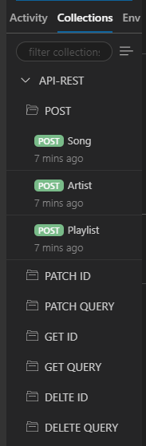
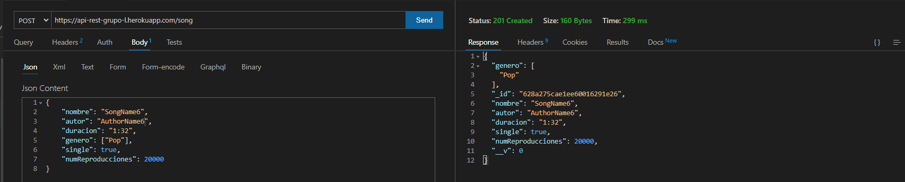
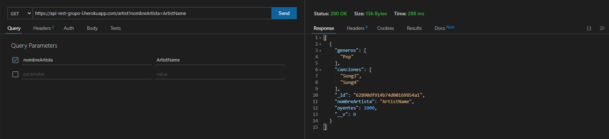
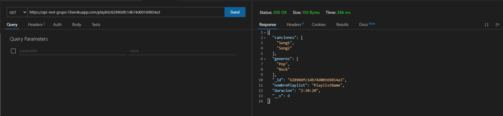
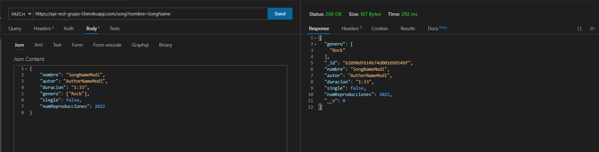
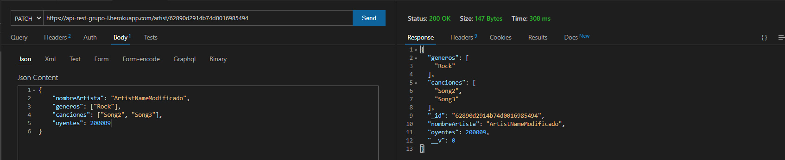
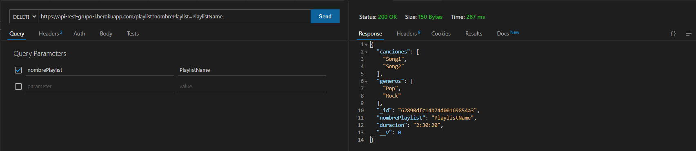
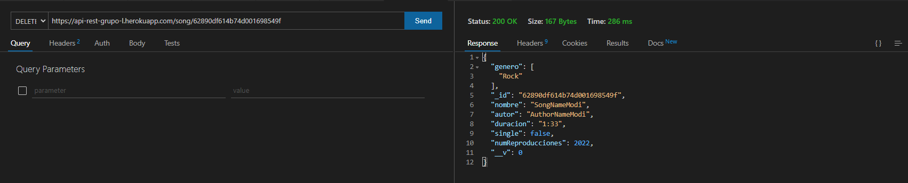

# Informe Práctica 12 - API Node/Express de gestión de información musical

## Desarrollo de Sistemas Informáticos

## Componentes del grupo L

- Marcos Jesús Santana Ramos ([alu0101033471@ull.edu.es](alu0101033471@ull.edu.es))
- Héctor Abreu Acosta ([alu0101068855@ull.edu.es](alu0101068855@ull.edu.es))
- Marcos Padilla Herrera ([alu0101045177@ull.edu.es](alu0101045177@ull.edu.es))
- Andrea Calero Caro ([alu0101202952@ull.edu.es](alu0101202952@ull.edu.es))

## Índice

- Estructura del proyecto
- Estructura del Servidor
- Modelos de la API:
    - Canción
    - Artista
    - Playlist
- Rutas de la API:
    - Índice de rutas
    - Rutas de los modelos
- Despliegue
- Modo de uso
- Controles de calidad con Sonar Cloud
- Referencias
- Conclusión


## Estructura del proyecto

Para el desarrollo de esta práctica se ha contado con un fichero que tendrá el servidor que procesará una conexión con **_MongoDB_** y 2 directorios:

Por un lado el directorio **models** que contiene 3 ficheros: **artistas.ts**, **cancion.ts** y **playlist.ts**, cada fichero tendrá una interfaz, esquema y modelo asociado, con la ayuda del Módulo **_Mongoose_** y sus respectivos validadores del paquete **_Validator_**. 

Por otro lado el directorio **routes** que contiene 4 ficheros: **artista.routes.ts**, **cancion.routes.ts**, **playlist.routes.ts** e **index.routes.ts**. En estos ficheros se han definido las rutas en las que se podrán realizar peticiones. Para poder trabajar correctamente con la API, además se añadió un índice de rutas en el fichero **index.routes.ts** y se ha importado en el servidor.


## Estructura del Servidor

El fichero principal del proyecto es **server.ts**. Es el encargado de gestionar el funcionamiento el servidor en **_express_** sobre el que funcionará la API.

Para su implementación, se ha creado una clase Server, en la que se inicializa la aplicación.

El servidor cuenta con 4 funciones principales:
[x] Constructor
[x] Configure
[x] Routes
[x] Start


### Constructor
Se genera el objeto servidor, instancia la aplicación y llama a los métodos **configure()** y **routes()**, dejando el servidor a punto para poder ponerse en modo de escucha.

### Configure
Este método de configuración del servidor comienza creando una variable DATABASE en la que almacena la dirección de conexión de la base de datos local. A continuación, se inicializa la conexión a MongoDB mediante mongoose.

Mongoose hace uso de la variable de entorno **process.env.PORT** para seleccionar el puerto al que se conectará. Si esta variable no existe, se utiliza la ruta almacenada en la constante DATABASE por defecto.

Se establece una serie de propiedades para el uso de mongoose, y se muestra por consola si la conexión ha sido exitosa o no. Configura el puerto de escucha al almacenado en la variable de entorno PORT, o en su defecto, al puerto 3000.

Por último, se usaron algunos middlewares que utiliza el servidor. En este caso, son los siguientes:

- [**Morgan**](https://expressjs.com/en/resources/middleware/morgan.html): Genera un log básico cada vez que se recibe una petición, indicando el tipo, la ruta, el código de estado y el tiempo que tardó en ejecutarse.
- [**express.json**](https://es.acervolima.com/funcion-express-js-express-json/): Permite trabajar con formato json en las peticiones y respuestas, convirtiendo los datos.
- [**express.urlencoded**](https://es.acervolima.com/funcion-express-js-express-urlencoded/): Gestiona la codificación de las urls y los cuerpos de las peticiones.
- [**compression**](https://www.npmjs.com/package/compression): Minimiza el tamaño de las peticiones y respuestas.

### Routes
Se encarga de gestionar las rutas de la API que se alojan en el fichero **index.routes.ts**. En este caso, únicamente indica que se hace uso de las rutas almacenadas en el índice de rutas del servidor:

```typescript
this.app.use(apiRoutes);
```

### Start
Esta función se encarga de arrancar el servidor en modo de escucha. Para ello, utiliza el puerto almacenado anteriormente en la configuración.

## Modelos de la API

Los modelos de la API asociados a las canciones, artistas y playlists están alojados en el directorio **models** que contiene 3 ficheros: **cancion.ts**, **artistas.ts** y **playlist.ts** respectivamente. 

Cada fichero tendrá una interfaz, esquema y modelo asociado, con la ayuda del Módulo **_Mongoose_** y sus correspondientes validadores del paquete **_Validator_**. 

Con ello se respetan los principios básicos **SOLID**.

### Canción

El primer modelo que se va a analizar es el correspondiente a cancion.ts. La interfaz tendrá los atributos necesarios para definir una canción, un nombre de la canción, autor, duración, género, single (indica con un tipo boolean si es o no un sigle) y el número de reproducciones. Siguiendo una interfaz tal que:

```typescript
export interface CancionInterface{
  nombre: string,
  autor: string,
  duracion: string,
  genero: string[],
  single: boolean,
  numReproducciones: number
}
```

A continuación, estos serán desplegados en un Schema de mongoose. Dentro del Schema denotado por **CancionSchema** se asignarán los validadores correspondientes en caso de ser necesario. En el caso de canción, todos los atributos tienen validadores, excepto el nombre de la canción. Ya que la canción puede empezar por letra, número o incluso símbolo.

Sin embargo los que tienen validadores se puede observar que mediante **validate:** se comprueba que tiene que cumplir el atributo. Se expondrá la lógica de cada validador:

[x] **autor**: En el caso del autor se quiere que este string empiece por mayúsculas, ya que es un nombre propio.
[x] **duracion**: En el caso de la duración se quiere que el valor sea un string que cumpla la estructura siguiente "2:30" o "04:20". Para ello se definió la siguiente expresión regular:

```typescript
^([01]?[0-9]|2[0-3]):[0-5][0-9]$
```

[x] **genero**: Como género es un array de string lo que se quiere es recorrer ese array y comprobar que cada elemento de este (cada género) empiece con mayúsculas, como en el caso del autor.
[x] **single** y **numReproducciones**: La lógica de ambos validadores es similar pero adaptado a cada tipo de atributo. Este validador comprueba que el valor sea del tipo que se requiere, ejemplo: en el caso de single que sea un tipo boolean con **isBoolean()** y en el caso de numReproducciones que sea un tipo number con **isNumeric()**.

La mayoría de los validadores se reutilizan en atributos de las otras opciones (artistas.ts y playlist.ts).

Finalmente se define el modelo con Mongoose que se exportará de la canción con dicho esquema. Y se exportará para su posterior utilización.

```typescript
const Cancion = mongoose.model<CancionInterface>("Cancion", CancionSchema);
export default Cancion;
```

### Artista

El siguiente modelo que se va a analizar es el correspondiente a artistas.ts. La interfaz tendrá los atributos necesarios para definir un artista, un nombre del artista, géneros, canciones del artista y el número de oyentes. Siguiendo una interfaz tal que:

```typescript
 export interface ArtistasInterface {
	nombreArtista: string,
	generos: string[],
	canciones: CancionInterface[],
	oyentes: number;
}
```

A continuación, estos serán desplegados en un Schema de mongoose. Dentro del Schema denotado por **ArtistaSchema** se asignarán los validadores correspondientes en caso de ser necesario. Así como en canción se usó validadores ya conocidos:


[x] **nombreArtista**, **generos**: En estos casos el validador comprueba que empiece por letra mayúscula.
[x] **canciones**: Como es un array de string, se recorre y se comprueba que estos nombres empiecen por mayúscula.
[x] **oyentes**: En el caso de los oyentes se comprueba que este tipo sea de tipo number con **isNumeric()**.

Finalmente se define el modelo con Mongoose que se exportará del artista con dicho esquema. Y se exportará para su posterior utilización.

```typescript
const Artistas = mongoose.model<ArtistasInterface>("Artista", ArtistaSchema);
export default Artistas;
```

### Playlist

El último modelo que se va a analizar es el correspondiente a playlist.ts. La interfaz tendrá los atributos necesarios para definir una playlist, un nombre de la playlist, las canciones que contiene, la duración total y los géneros. Siguiendo una interfaz tal que:

```typescript
export interface PlaylistInterface {
	nombrePlaylist: string;
	canciones: CancionInterface[];
	duracion: string;
	generos: string[];
}
```

A continuación, estos serán desplegados en un Schema de mongoose. Dentro del Schema denotado por **PlaylistSchema** se asignarán los validadores correspondientes en caso de ser necesario. Así como en canción y artistas se usó validadores ya conocidos:


[x] **nombrePlaylist**: En este caso el validador comprueba que empiece por letra mayúscula.
[x] **canciones** y **generos**: Como son arrays de string, se recorren y se comprueba que estos nombres empiecen por mayúscula.
[x] **duracion**: Sigue la lógica del atributo duración de Canción, pero como una playlist puede contener varias canciones entonces la duración total es mayor. Por ello se ideó una nueva expresión regular que cumpla con la estructura de "2:35", "2:40:10" o "05:10". Para que así consiga duraciones incluso de horas, minutos y segundos.

```typescript
^([01]?[0-9]|2[0-3]):[0-5][0-9](:[0-5][0-9])?$
```

Finalmente se define el modelo con Mongoose que se exportará de la playlist con dicho esquema. Y se exportará para su posterior utilización.

```typescript
const Playlist = mongoose.model<CancionInterface>("Playlist", PlaylistSchema);
export default Playlist;
```

## Rutas de la API

Para poder trabajar correctamente con la API, deben definirse las rutas en las que se podrán realizar peticiones. Para ello, se ha definido un índice de rutas en el fichero index.routes.ts y se ha importado en el servidor.

### Índice de rutas

En el fichero índice de las rutas se ha definido una clase **ApiRoutes**. Esta clase hace uso de un objeto Router para volver accesibles todas las rutas de la aplicación.

Define un mensaje de respuesta al hacer una petición a la raíz, indicando al usuario dónde se encuentra la API. Además, es aquí donde se importan y asignan a este Router todos los archivos de routas de la API, en este caso, las rutas de canciones, artistas y playlist. Esto se hace en el método **routes()**:

```typescript
routes() {
    this.router.get('/', (req, res) => {
        res.send("Para usar la API situate en: /song /artist /playlist");
    })
    this.router.use(cancionRoutes);
    this.router.use(artistaRoutes);
    this.router.use(playlistRoutes);
}
```


### Rutas de los modelos

Para cada tipo de modelo se ha creado un archivo de rutas para gestionar las peticiones. Todos tienen un comportamiento muy similar, por lo que se usará como ejemplo el archivo de cancion.

En el fichero **cancion.routes.ts** se almacena la ruta en la que se pueden hacer peticiones relacionadas a las canciones de la API. Es aquí donde se definen los métodos encargados de procesar cada tipo de petición, y devolver la respuesta correspondiente. Todo esto se hace desde la clase CancionRoutes, haciendo uso de un objeto Router igual que en index.

Para esta práctica se han implementado 7 tipos de peticiones diferentes y a la vez similares, ya que 4 son los básicos métodos **get**, **post**, **patch** y **delete**, y los otros 3 son variantes de ellos, ya que se realizan buscando, actualizando o borrando por id de la canción en vez de por su nombre. Estos métodos son **getCancionById()**, **patchCancionById** y **deleteCancionById** respectivamente.

Todos los métodos tienen una petición (Request) y una respuesta a la misma (Response). Si se consigue satisfactoriamente buscar, añadir, actualizar o borrar una cancion, en este caso, entonces se muestra una respuesta de aceptación del tipo 200 con **res.send()** o se muestra dicha canción. En caso de error se muestra de respuesta un mensaje tipo 404. Y si el caso es fallo sel servidor una de tipo 500.

Dentro de cada método **getCancion()**, **postCancion()**, **patchCancion()** y **deleteCancion()** las peticiones son mediante **req.query.nombre**. Mientras que en los casos de los métodos que busquen, actualicen o borren la canción por el id, entonces la petición es mediante **req.params.id** de la canción.

Finalmente, el método routes() es el encargado de gestionar las peticiones. Para mantener el código más organizado, existe un método independiente encargado de gestionar cada tipo de petición, y routes simplemente deriva la petición al método correspondiente. Se hace de la siguiente manera:

```typescript
routes() {
    this.router.get('/song', this.getCancion);
    this.router.get('/song/:id', this.getCancionById);
    this.router.post('/song', this.postCancion);
    this.router.patch('/song', this.patchCancion);
    this.router.patch('/song/:id', this.patchCancionById);
    this.router.delete('/song', this.deleteCancion);
    this.router.delete('/song/:id', this.deleteCancionById);
}
```

Y así, se efectúa la misma lógica para cada uno de los ficheros de rutas de artistas y playlist. Sólo que en el método routes() se gestiona cada petición en una ruta de la API distinta. En el caso de canción es en **/song**, en el caso de artista en **/artist** y en el caso de playlist en **/playlist**.

## Despliegue

El proyecto se ha desarrollado en mediante el uso de [MongoBD Atlas](https://www.mongodb.com/es), que es un servicio en la nube para bases de datos que posibilita crear bases de datos las cuales son expuestas online y por ende, permite conectar nuestras aplicaciones. Además, para desplegar nuestra API, nos apoyamos en [Heroku](https://id.heroku.com/login) que es una herramienta que facilita a los desarrolladores el testeo y/o análisis del comportamiento de las APIs en un entorno de pruebas.


## Modo de uso

En este apartado se pasará a explicar el modo de uso de la API, teniendo en cuenta el despliegue con MongoDB Atlas y Heroku. Primero, para desplegar la aplicación en Heroku, simplemente, se debe empujar los cambios al remoto añadido durante el proceso de creación de la aplicación, mediante el comando:

> git push heroku main

Luego se comprueban los logs correspondientes a nuestra aplicación, con el comando:

> heroku logs | tail -10f

Tras ello, se tendrá todo listo para la ejecución de la API, haciendo uso de un cliente como el que proporciona la extensión de Thunder Client. Para ello se introduce la URL de conexión en la que se ha desplegado el API y con la que se ejecutarán las distintas peticiones antes nombradas.

A su vez en el desplegado de la aplicación se guardó como colección API REST, dentro de esta colleción se añadieron como directorios: POST, PATCH ID, PATCH QUERY, GET ID, GET QUERY, DELETE ID y DELETE QUERY. A su vez, en cada directorio se hace dicha petición para song, artist y playlist. Mostrándose tal que:



Se pasará a mostrar ejemplos de ejecución de las peticiones para song, artist y playlist. Uno para cada para ver varios ejemplos.

### POST

En este apartado se añadirá un request que se llama POST para song.

#### SONG
 
Se añadirá una nueva canción que es **SongName6** con sus atributos correspondientes. Generando así un código de acierto (200) de que se creó correctamente y asignándole un id específico.




### GET QUERY

En este apartado se añadirá un request que se llama GET, GET QUERY ya que se basa en buscar por el nombre de artist.

#### ARTIST

Se buscará por el nombre del artista con nombre **ArtistName**. Y esta petición tras generar un código de acierto (200) de que se encontró el artista con ese nombre, se muestra los atributos que contiene como los géneros, canciones, oyentes, etc.




### GET ID

En este apartado se añadirá un request que se llama GET ID, ya que se basa como el GET QUERY en buscar, pero esta vez por el id de playlist.

#### PLAYLIST

Se buscará por el id de la playlist con id **62890dfc14b74d00169854a3**. Y esta petición tras generar un código de acierto (200) de que se encontró la playlist con ese id, se muestra los atributos que contiene como los géneros, canciones, duración, etc.




### PATCH QUERY

En este apartado se añadirá un request que se llama PATCH, PATCH QUERY ya que se basa en actualizar por el nombre de song.

#### SONG

Se actualizará por el nombre de la canción, en este caso con nombre **SongName** y se modificará en el body del query poniéndole como nuevo nombre de la canción **SongNameModi** y como nombre del autor **AuthorNameModi**. Y esta petición tras generar un código de acierto (200) de que se actualizó la canción con ese nombre, se muestra los atributos que contiene como los géneros, el id, y los nuevos atributos modificados.




### PATCH ID

En este apartado se añadirá un request que se llama PATCH ID, que se basa en actualizar por el id de artist.

#### ARTIST

Se actualizará por el id del artista, en este caso con id **62890d2914b74d0016985494** y se modificará en el body del query poniéndole como nuevo nombre del artista **ArtistNameModificado** y en numero de oyentes añadiéndole al final un 9. Con esto se muestra que en las peticiones PATCH se pueden modificar cualquier atributo. Y esta petición tras generar un código de acierto (200) de que se actualizó el artista con ese id, se muestra los atributos y los nuevos que fueron modificados.




### DELETE QUERY

En este apartado se añadirá un request que se llama DELETE, DELETE QUERY que se basa en borrar por el nombre de la playlist.

#### PLAYLIST

Se borrará por el nombre de la playlist, en este caso con nombre **PlaylistName** y se borrará. Y esta petición generará un código de acierto (200) de que se eliminó la playlist con ese nombre y sus atributos correspondientes.




### DELETE ID

En este apartado se añadirá un request que se llama DELETE ID, en borrar por el id de la canción.

#### SONG

Se borrará por el id de la canción, en este caso con id **62890df614b74d001698549f**, este id corresponde a la canción que se modificó en el PATCH QUERY de este informe y se llama **SongNameModi**. Y esta petición generará un código de acierto (200) de que se eliminó la canción con ese id y sus atributos correspondientes.




Finalizando este modo de uso se exportó el thunder-collection (en formato JSON) en la raíz del proyecto, para su importación y comprobación del uso de estas peticiones ya nombradas.


## Controles de calidad con Sonar Cloud

La web Sonar Cloud permite hacer un seguimiento a la calidad del código, teniendo en cuenta diversos factores. Para esta práctica, se ha hecho especial hincapié a la calidad, la mantenibilidad, los bugs y la seguridad, aunque SonarCloud incluye muchos más parámetros.

Se han añadido esas insignias a la documentación del código.

[](https://github.com/ULL-ESIT-INF-DSI-2122/ull-esit-inf-dsi-21-22-prct12-music-api-grupo_l/actions/workflows/sonarcloud.yml)

## Referencias 

* **[Typedoc](https://typedoc.org/).**
TypeDoc es un generador de documentación mediante los propios comentarios del código.  

* **[Mocha](https://mochajs.org/)**
Framework para las pruebas creadas para el código.  

* **[Chai](https://www.chaijs.com/)**
Biblioteca de aserciones BDD / TDD para el nodo y el navegador que se puede combinar con cualquier marco de prueba de JavaScript.  

* **[Instanbul](https://istanbul.js.org/)**
Herramienta para el encubrimiento del código implementado.

* **[CoverAlls](https://coveralls.io/)**
Herramienta de análisis de encubrimiento del código.

[](https://github.com/ULL-ESIT-INF-DSI-2122/ull-esit-inf-dsi-21-22-prct12-music-api-grupo_l/actions/workflows/sonarcloud.yml)


## Conclusiones
Como hemos podido comprobar durante la realización de esta práctica, la creación y configuración de APIs con NodeJS y un servidor en express se vuelve bastante sencillo, dejando la mayor complicación en la forma de gestionar las peticiones.

El uso de MongoDB Atlas y de Heroku, además, vuelve muy simple e intuitivo el proceso de despliegue y puesta en producción, y permite manejar de una forma sencilla las APIs REST, almacenando su información en bases de datos rápidas y eficaces.
